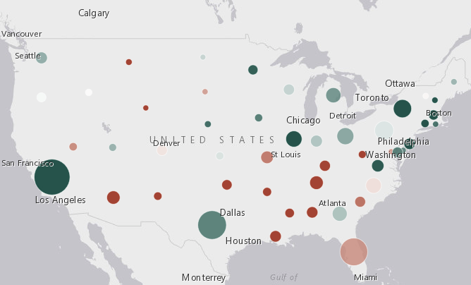

# Esri European DevSummit Plenary Demos

You can use the [template](./demos/template) demo app to set your own demo.

To display a link to the demo in the main page, create a `thumbnail.png` of your app in your demo folder add it to the root `index.html` like this.

```html
<!-- WebMap -->
<div class="card block trailer-1">
  <figure class="card-image-wrap">
    
    <figcaption class="card-image-caption">
      WebMaps
    </figcaption>
  </figure>
  <div class="card-content">
    <p class="font-size--1 card-last">Demo template for European DevSummit Plenary.</p>
    <a href="./demos/template/index.html" class="btn btn-clear btn-fill leader-1" target="_blank">View Demo</a>
  </div>
</div>
```